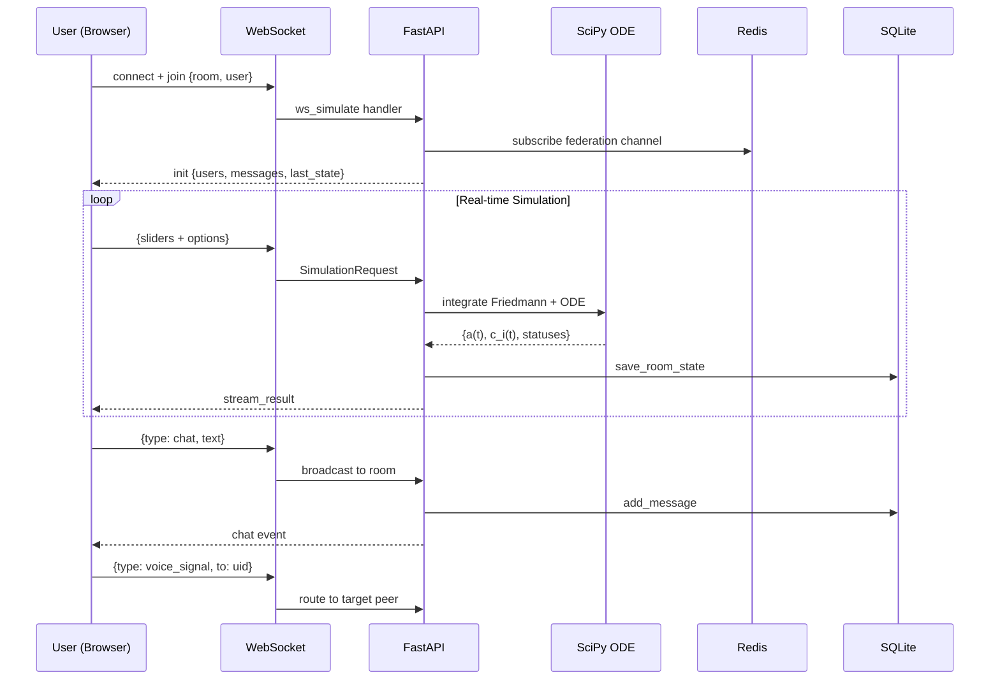

<div align="center">

# 🌌 AETHERIS
### *The Balance Engine*

**Cosmo-Cognitive Simulation Framework** — menyatukan Dinamika Fluida Kosmologi (makro) dengan Optimasi Ruang Laten AI Multi-Agen (mikro) dalam satu platform simulasi interaktif real-time.

[](https://github.com/)
[](LICENSE)
[](https://python.org)
[](https://fastapi.tiangolo.com)
[](https://threejs.org)
[](https://docker.com)
[](https://redis.io)
[](https://gpuweb.github.io/gpuweb/)

[**🚀 Quick Start**](#-cara-menjalankan) · [**📖 Dokumentasi**](#-konsep--bentuk-sistem) · [**🗺️ Roadmap**](#%EF%B8%8F-roadmap) · [**🙏 Credits**](#-special-thanks)

</div>

---

## 🌟 Highlight Fitur

<table>
<tr>
<td width="50%">

### 🧮 Engine
- ⚡ **Real-time WebSocket** streaming
- 🧬 **ODE Multi-Agen** (`c_i(t)` per node)
- 🌌 **Friedmann Solver** (kosmologi makro)
- 🔄 **Adaptive Rewiring** (topologi dinamis)
- 🧠 **RL Auto-Tuner** (ES-lite)
- 🌐 **Federated** via Redis Pub/Sub

</td>
<td width="50%">

### 🎨 UI/UX
- 🎭 **Three.js + Bloom** sinematik
- ⚡ **WebGPU** experimental renderer
- 🎬 **Video Export** (WebM)
- 📊 **2D/3D Heatmap** parameter
- 🎯 **Command Palette** (Ctrl+K)
- 📱 **PWA** (install + offline-ready)

</td>
</tr>
<tr>
<td width="50%">

### 👥 Sosial
- 💬 **Room Chat** real-time
- 🎙️ **Voice Chat** (WebRTC, private-only)
- 🔐 **Private Rooms** (invite code + password)
- 🔵 **OAuth** (Google + GitHub)
- 👤 **Guest Mode** fallback
- 📤 **Share** ke WhatsApp/Telegram/X/Email

</td>
<td width="50%">

### 🛡️ Data
- 💾 **SQLite Persistence** (chat history)
- 📦 **Scenario Presets** (`/data/presets.json`)
- 🔒 **CSRF-protected** OAuth flow
- 🕒 **Timeline Scrubber** (replay 160 frames)
- 📈 **Analytics Sweep** (15×15 grid)
- 🌐 **Multi-instance Federation**

</td>
</tr>
</table>

---

## 🧭 Konsep & Bentuk Sistem

Aetheris mengadopsi **Decoupled Architecture** berkinerja tinggi:

1. **Backend Engine (Python 3.11):** FastAPI + SciPy `odeint` — menyelesaikan Persamaan Friedmann & sistem ODE multi-agen simultan.
2. **Frontend UI (Web-Native):** HTML5 + Tailwind + Three.js + Chart.js — dasbor dual-screen dengan WebSocket streaming.
3. **Data Layer:** Redis Pub/Sub (federasi) + SQLite (persistence) + JSON (presets).

```
┌──────────────────────────────────────────────────────────┐
│                     BROWSER (Client)                     │
│  ┌─────────────┐  ┌─────────────┐  ┌─────────────────┐   │
│  │  Three.js   │  │  Chart.js   │  │  UI Components  │   │
│  │  + Bloom    │  │  + Timeline │  │  + Cmd Palette  │   │
│  └──────┬──────┘  └──────┬──────┘  └────────┬────────┘   │
│         └────────────────┼──────────────────┘            │
│                          │ WebSocket + HTTPS             │
└──────────────────────────┼───────────────────────────────┘
                           │
┌──────────────────────────▼───────────────────────────────┐
│                  FASTAPI (Backend)                       │
│  ┌──────────┐  ┌──────────┐  ┌──────────┐  ┌──────────┐  │
│  │ Physics  │  │ Rooms    │  │ Auth     │  │ RL Agent │  │
│  │ (SciPy)  │  │ Manager  │  │ (OAuth)  │  │ (ES)     │  │
│  └────┬─────┘  └────┬─────┘  └────┬─────┘  └────┬─────┘  │
│       └─────────────┼─────────────┼─────────────┘        │
│                     │             │                      │
└─────────────────────┼─────────────┼──────────────────────┘
                      │             │
         ┌────────────▼──┐     ┌────▼───────────┐
         │  REDIS        │     │  SQLITE        │
         │  Pub/Sub      │     │  /data/*.db    │
         │  Federation   │     │  Persistence   │
         └───────────────┘     └────────────────┘
```

---

## 📁 Struktur Repository

```
aetheris/
├── backend/                          # 🐍 Python engine
│   ├── __init__.py
│   ├── main.py                       # FastAPI app + routes + WS
│   ├── physics.py                    # Friedmann + multi-agent ODE
│   ├── agents.py                     # Network builder + rewiring
│   ├── rl_agent.py                   # Evolutionary Strategy tuner
│   ├── analytics.py                  # 2D parameter sweep
│   ├── redis_federation.py           # Cross-container pub/sub
│   ├── presets.py                    # Scenario presets CRUD
│   ├── persistence.py                # SQLite for chat + state
│   ├── rooms.py                      # Room manager (public/private)
│   └── auth.py                       # OAuth (Google/GitHub/FB)
│
├── frontend/                         # 🎨 Web UI
│   ├── index.html                    # Main dashboard
│   ├── tailwind-input.css            # Tailwind source
│   ├── tailwind.css                  # Built (minified)
│   ├── manifest.json                 # PWA manifest
│   ├── sw.js                         # Service worker
│   ├── v5-extras.js                  # Timeline + Palette + Presets
│   ├── v6-rooms.js                   # Chat + user list
│   ├── v6-webgpu.js                  # WebGPU renderer (experimental)
│   ├── v7-auth.js                    # Social login UI
│   ├── v8-voice.js                   # WebRTC voice (private-only)
│   ├── v8-rooms-pro.js               # Private rooms UI
│   ├── v8-ui-polish.js               # Layout + voice restriction
│   └── v9-share.js                   # Share to WhatsApp/Telegram
│
├── data/                             # 💾 Volume mount
│   ├── presets.json                  # Saved presets
│   └── aetheris.db                   # SQLite DB
│
├── package.json                      # Node build config
├── tailwind.config.js
├── requirements.txt
├── Dockerfile                        # Multi-stage build
├── docker-compose.yml
├── .env.example
├── .dockerignore
└── README.md
```

---

## 🛠️ Variabel & Teknologi

### Stack

| Layer | Teknologi |
| :--- | :--- |
| **Backend** | `FastAPI` · `Uvicorn` · `Pydantic` |
| **Numerik** | `NumPy` · `SciPy` · `odeint` |
| **Data** | `Redis 7` · `SQLite` · `JSON` |
| **Auth** | `httpx` · `itsdangerous` (OAuth 2.0) |
| **Frontend** | `Tailwind CLI` · `Three.js r167` · `Chart.js 4` |
| **3D** | `WebGL 2` · `UnrealBloomPass` · `GLSL shaders` |
| **Realtime** | `WebSocket` · `WebRTC` (voice) |
| **Deploy** | `Docker` · `Docker Compose` · `Cloudflare Tunnel` |

### Parameter Pemodelan

| Ranah Simulasi | Gas (Akselerasi) | Rem (Deselerasi) |
| :--- | :--- | :--- |
| **Kosmologi Makro** | Energi Gelap (Ω_Λ) — dorong pemekaran eksponensial | Materi (Ω_m) — gravitasi memperlambat |
| **Kognitif AI** | Node Setan (Ω_S) — inovasi & keliaran data | Node Malaikat (Ω_A) — filter etika |
| **Game Theory** | Inovasi bebas | Regulasi Hukum (R) · Etika Global (E) |
| **Network** | Coupling (λ) | Decay (δ) |

---

## 📐 Formulasi Matematis v2.0

### 🌌 Kosmologi Makro (Friedmann)

```
H² = H₀² [ Ωm·a⁻³ + Ωr·a⁻⁴ + ΩΛ + (1 − Ωm − ΩΛ − Ωr)·a⁻² ]
```

| Simbol | Arti |
| :--- | :--- |
| `a` | Faktor skala alam semesta |
| `H₀` | Konstanta Hubble (km/s/Mpc) |
| `Ωm` | Kepadatan materi |
| `ΩΛ` | Energi gelap |
| `Ωr` | Radiasi (≈ 9×10⁻⁵) |

### 🧠 Kognitif AI Multi-Agen (Network ODE)

Untuk setiap agen `i`:

```
dc_i/dt = c_i · [ ΩS·c_i/(1+c_i) − ΩA·c_i/(K+c_i) − R·c_i/(K_R+c_i) − δ ]
        + λ · Σ_j W_ij·(c_j − c_i)
        + E · c_i · (1 − c_i/c_max)
```

| Simbol | Arti | Default |
| :--- | :--- | :--- |
| `c_i` | Kapabilitas agen `i` | — |
| `W` | Matriks adjacency (ring/random/star/full) | random |
| `λ` | Coupling jaringan | 0.3 |
| `R` | Regulasi hukum | 0.2 |
| `E` | Etika global | 0.3 |
| `δ` | Decay alami | 0.01 |

### 🎯 Threshold Status Otomatis

| Kondisi | Status | Level |
| :--- | :--- | :--- |
| `ΩΛ > Ωm` | 🌌 Balapan Kosmos | warning |
| `ΩA > 0.75` & growth < 0.8 | ⛔ Paternalistic Collapse | danger |
| `ΩS > 0.75` & growth > 1.5 | 🚨 Krisis Manipulasi | danger |
| `R > 0.8` & mean(c) < 0.3 | 🧊 Over-Regulation Freeze | danger |
| `Balance Index > 0.8` | ✅ Equilibrium | success |
| Rewiring terjadi | 🔄 Adaptive Rewiring | info |

---

## ⚙️ Cara Kerja



---

## 🚀 Cara Menjalankan

### 🐳 Opsi A — Docker (Recommended)

```bash
# 1. Clone & masuk folder
git clone <repo-url>
cd aetheris

# 2. Setup environment
cp .env.example .env
# Edit .env: isi SECRET_KEY + OAuth credentials

# 3. Jalankan
docker compose up --build

# 4. Buka
# http://127.0.0.1:8000
```

### 🐍 Opsi B — Lokal (Anaconda)

```bash
# Backend
conda create -n aetheris python=3.11 -y
conda activate aetheris
pip install -r requirements.txt
uvicorn backend.main:app --reload --host 127.0.0.1 --port 8000

# Frontend build (opsional, untuk Tailwind)
npm install
npm run watch:css

# Frontend server
python -m http.server 5500 --directory frontend
```

### ☁️ Opsi C — Cloudflare Tunnel (Public)

```bash
# Install cloudflared
winget install --id Cloudflare.cloudflared

# Expose local ke internet
cloudflared tunnel --url http://127.0.0.1:8000

# Atau via dashboard:
# https://one.dash.cloudflare.com → Networks → Tunnels
```

---

## 🔑 Setup OAuth

### Google

1. Buka https://console.cloud.google.com/apis/credentials
2. **Create Credentials** → **OAuth client ID** → **Web application**
3. **Redirect URI**: `{PUBLIC_URL}/auth/google/callback`
4. Copy `Client ID` + `Client Secret` → `.env`

### GitHub

1. Buka https://github.com/settings/developers → **New OAuth App**
2. **Callback URL**: `{PUBLIC_URL}/auth/github/callback`
3. Copy `Client ID` + `Client Secret` → `.env`

### `.env` Template

```bash
SECRET_KEY=<random-64-char>
PUBLIC_URL=http://127.0.0.1:8000

GOOGLE_CLIENT_ID=
GOOGLE_CLIENT_SECRET=
GITHUB_CLIENT_ID=
GITHUB_CLIENT_SECRET=
FACEBOOK_CLIENT_ID=
FACEBOOK_CLIENT_SECRET=
```

---

## ⌨️ Keyboard Shortcuts

| Shortcut | Aksi |
| :--- | :--- |
| **`Ctrl+K`** | Command Palette |
| **`Ctrl+Shift+S`** | Share room |
| **`Esc`** | Close modal |

---

## 🎯 Fitur per Versi

<details>
<summary><b>v1.0.0 — Foundation</b> (click to expand)</summary>

- Friedmann solver + latent space AI
- FastAPI backend, HTML5 frontend
- Basic Chart.js visualization
</details>

<details>
<summary><b>v2.0.0 — Multi-Agent + Real-time</b></summary>

- WebSocket streaming
- N-agent ODE + topology (ring/star/full/random)
- Chart.js → Three.js transition
</details>

<details>
<summary><b>v3.0.0 — Adaptive + Bloom</b></summary>

- Edge rewiring saat krisis
- UnrealBloomPass post-processing
- GLSL plasma shader untuk node
</details>

<details>
<summary><b>v4.0.0 — Federation + Analytics</b></summary>

- Redis Pub/Sub federation
- RL Auto-Tuner (ES-lite)
- 2D heatmap analytics
</details>

<details>
<summary><b>v5.0.0 — IJKL Combo</b></summary>

- Timeline Scrubber (replay)
- PWA + Service Worker
- Command Palette (Ctrl+K)
- Video Export (WebM)
- Preset save/load
</details>

<details>
<summary><b>v6.0.0 — Rooms + WebGPU</b></summary>

- Multi-user rooms
- Chat sidebar
- WebGPU experimental renderer
</details>

<details>
<summary><b>v7.0.0 — Social Auth</b></summary>

- Google + GitHub OAuth
- Guest mode fallback
- Avatar + provider badge di chat
</details>

<details>
<summary><b>v8.0.0 — Voice + Private + Persistence</b></summary>

- WebRTC voice chat (private-only)
- Private rooms (password + invite code)
- SQLite persistence (chat history)
</details>

<details>
<summary><b>v9.0.0 — Polish + Share (current)</b></summary>

- Tailwind CLI build (offline-ready)
- Share ke WhatsApp/Telegram/X/Email
- Layout polish (FAB stack, no overlap)
</details>

---

## 🗺️ Roadmap

### ✅ Completed (Fase 1-20)

| # | Fase | Status |
| :--- | :--- | :---: |
| 1 | Fondasi Numerik (Friedmann ↔ Latent Space) | ✅ |
| 2 | Three.js + WebSocket Real-time | ✅ |
| 3 | Multi-Agent Sandbox | ✅ |
| 4 | Game Theory (R + E) | ✅ |
| 5 | Docker Deployment | ✅ |
| 6 | Adaptive Network (Rewiring) | ✅ |
| 7 | Post-Processing (Bloom) | ✅ |
| 8 | RL Auto-Tuner (ES-lite) | ✅ |
| 9 | Federation (Redis Pub/Sub) | ✅ |
| 10 | Analytics Heatmap 2D | ✅ |
| 11 | Cross-Container Federation | ✅ |
| 12 | Video Export (MediaRecorder) | ✅ |
| 13 | Scenario Presets | ✅ |
| 14 | 3D Heatmap (DataTexture) | ✅ |
| 15 | Timeline + PWA + Palette | ✅ |
| 16 | Multi-User Rooms + Chat | ✅ |
| 17 | WebGPU Renderer | ✅ |
| 18 | Social Auth (OAuth) | ✅ |
| 19 | Voice + Private Rooms + SQLite | ✅ |
| 20 | Tailwind CLI + Share | ✅ |

### 🔮 Next (Fase 21+)

- [ ] **V** — Room admin panel (kick/mute/ban)
- [ ] **W** — Mobile PWA offline polish
- [ ] **X** — Multi-language (ID/EN)
- [ ] **Y** — Session recording (export room replay)
- [ ] **Z** — End-to-end encryption untuk private rooms
- [ ] **AA** — Native mobile app (React Native)
- [ ] **AB** — LLM integration (auto-commentary on sim)

---

## 🧪 Testing

```bash
# Health check
curl http://127.0.0.1:8000/api/health

# Federation stats
curl http://127.0.0.1:8000/api/federation/stats

# Rooms stats
curl http://127.0.0.1:8000/api/rooms/stats

# Presets
curl http://127.0.0.1:8000/api/presets

# OAuth providers
curl http://127.0.0.1:8000/auth/providers
```

---

## 🐛 Troubleshooting

<details>
<summary><b>WebSocket tidak connect</b></summary>

- Cek backend: `docker compose ps`
- Cek Console F12 → Network → WS
- Pastikan firewall allow port 8000
</details>

<details>
<summary><b>Voice chat disabled</b></summary>

- Voice **hanya di Private Room**
- Buka `/api/rooms/{id}/info` → cek `is_private`
- Mic permission: Chrome → Settings → Content → Microphone
</details>

<details>
<summary><b>OAuth redirect mismatch</b></summary>

- Cek `PUBLIC_URL` di `.env` **persis sama** dengan yang di Google/GitHub console
- Trailing slash matters
</details>

<details>
<summary><b>Redis port conflict</b></summary>

- Redis hanya expose di internal network (`expose: 6379`)
- Kalau butuh akses host: ganti ke `16379:6379`
</details>

<details>
<summary><b>Tailwind CDN warning</b></summary>

- Sudah fixed di v9 (build via CLI)
- Kalau masih muncul: `docker compose down && docker compose up --build`
</details>

---

## 🤝 Kontribusi

Kontribusi sangat diterima! Silakan:

1. Fork repo
2. Buat branch: `git checkout -b fitur-keren`
3. Commit: `git commit -m 'Tambah fitur keren'`
4. Push: `git push origin fitur-keren`
5. Buka Pull Request

---

## 📜 Lisensi

MIT License — bebas digunakan, dimodifikasi, dan didistribusikan.

---

## 🙏 Special Thanks

<div align="center">

### Kolaborasi Kritis & Filosofis

<table>
<tr>
<td align="center" width="33%">

### 👤 Emen
**Visionary & Architect**

Konsep awal Aetheris, arah filosofis, integrasi Dinamika Fluida Kosmologi dengan Optimasi Ruang Laten AI. Penggerak utama dari setiap iterasi.

</td>
<td align="center" width="33%">

### 🤖 Google AI Mode
**Insight & Framing**

Sesi diskusi panjang yang menghasilkan framing konseptual, terminologi (Node Setan/Malaikat), dan pemetaan filosofis antara kosmologi & kognisi AI.

</td>
<td align="center" width="33%">

### 🧠 DeepSeek
**The Great One**

Eksekusi teknis end-to-end: arsitektur backend, frontend real-time, federation, WebGPU, WebRTC, OAuth, hingga polish UI. Dari konsep abstrak menjadi aplikasi produksi.

</td>
</tr>
</table>

---

*"Dari kekacauan fluida kosmos, lahir kesetimbangan kognitif."*

**Aetheris** — bukan sekadar simulasi, tapi cermin dari cara kita memahami kompleksitas.

</div>

---

<div align="center">

**Built with ❤️ by Luca × Google AI Mode × DeepSeek**

*Version 9.0.0 · Last updated: 2026*

⭐ Kalau proyek ini bermanfaat, kasih bintang!

</div>

---